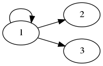
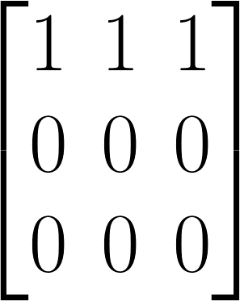

# 二元关系——基础知识

> 前言：「离散数学」中相当复杂抽象的一章，好好总结，好好复习

## 0X00 「有序对」与「笛卡尔积」

### 什么是「有序对」

我们用 <x, y> 表示有序对，对于有序对有以下性质：

+ <x, y> = <u, v> 的充分必要条件是 x = u，y = v

   

### 什么是「笛卡尔积」

设 A，B 为集合，用 A 中的元素作为第一元素，用 B 中的元素作为第二元素构成有序对的过程叫做笛卡尔积，用符号 × 表示。

举个例子，假设有 $A=\{1, 2\}$、$B = \{3, 4\}$ 两个集合，求 A × B：

按照定义，求得：  

$A × B = \{<1, 3>, <1, 4>, <2, 3>, <2, 4>\}$

### 「笛卡尔积」的运算规则

+ 笛卡尔积不满足「交换律」、「结合律」

+ 笛卡尔积对「并和交运算」满足「分配率」有以下等式：

$A × (B \cup C) = (A × B) \cup (A × C) $

### 0X01 「二元关系」的定义

如果一个集合是满足以下两个条件：

+ 集合非空，每个元素都是有序对
+ 集合为空集

则称该集合为一个`二元关系`，对于`二元关系` R 来说，如果 $<x, y> \in R$ 则可以记做：$x R y$。反之，如果 $<x, y> \not\in R$ 可以记做：

### 特殊「二元关系」

二元关系可以看做两个集合的笛卡尔积，所以我们有如下定义：

`设 A、B 为集合，A × B 的任何子集都可以被当做从 A 到 B 的二元关系，特别当 A = B 的时候，称作 A 的二元关系`

据此，当 A = B 的时候，我们有几个`特殊的二元关系`：

假设 $A = \{1, 2\}$

+ **空关系**

空集 $\emptyset$ 是 A×A 的子集，称作 A 上的`空关系`

+ **全域关系**

$E_A = \{<x, y>|x \in A \cap y \in A\} = A × A$

比如上面这个例子，A 上的全域关系就是：

$E_A = \{<1, 1>, <1, 2>, <2, 1>, <2, 2>\}$

+ **恒等关系**

$I_{A} = \{<x, x>| x \in A\}$

比如上面这个例子：A 上的恒等关系就是：

$I_{A} = \{<1, 1>, <2, 2>\}$

### 「二元关系」的几种表示方法

除了用集合的方式表示`二元关系`，我们还可以用其他的方法表示`二元关系`：`关系矩阵`以及`关系图`

比如在集合 $A = \{1, 2, 3\}$ 上有关系 $R = \{<1, 1>, <1, 2>, <1, 3>\}$

我们用`关系图`表示就是：

同样的我们用`关系矩阵`表示：

其本质意思就是记录一个「有向图」

二元关系的基础知识到此结束

## 0X02 latex 常见集合符号

- 集合中的 "|"：                  \mid
- 属于：                            \in
- 不属于：                        \not\in
- A包含于B：                   A \subset B
- A真包含于B：               A \subsetneqq B
- A包含B：                      A \supset B
- A真包含B：                  A \supsetneqq B
- A不包含于B：              A \not\subset B
- A交B：                         A \cap B
- A并B：                         A \cup B
- A的闭包：                    \overline{A}
- A减去B:                        A \setminus B
- 实数集合：                   \mathbb{R}
- 空集：                          \emptyset

