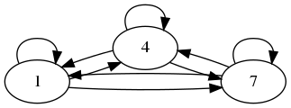
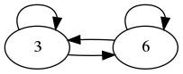
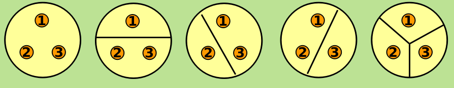

# 等价关系与划分

> 前言：本篇博客主要对「等价关系」的相关知识进行总结

之前我们学习了，关系的基本定义，但在这篇博客中，我们将学习到`一种特殊的关系`

## 0X00 「等价关系」

`假设 R 为非空集合 A 上的关系`

### 「等价关系」的基本定义

如果 R 是`自反的`、`对称的`、`传递的`，则称 R 为 A 上的`等价关系`

这样很抽象我们来举个例子：

假设$A = \{1, 2, 3, 4, 5, 6, 7, 8\}$，我们在 A 上定义以下关系 $R = \{<x, y>| x, y \in A \wedge x \equiv y\  (mod 3)\}$，用大白话说就是在 A 中找出所有模 3 相等的数，并组成有序对：

按此我们可以写出以下关系：

$$R = \{<1, 1>, <4, 4>, <7, 7>, <1, 4>, <1, 7>, <4, 7>, <4, 1>, <7, 1>, <7, 4>...\}$$

上面的 R 我没列完全，只列出了余 1 的情况，还有余 2 的情况、余 0 的情况

我们画出 R 的「关系图」：

可以清楚的看到： R 是`自反的`、`对称的`、`传递的`，所以 R 是一个`等价关系`

### 「等价类」的基本定义

搞清楚了`等价关系`以后开始搞`等价类`，

等价类的基本定义如下：

设 R 为非空集合 A 上的等价关系，$\forall x \in A$，令 

$$[x]_{R} = \{y\ |\ y \in A \wedge xRy\}$$

称 $[x]_{R}$ 为关于 R 的`等价类`，简称 x 的`等价类`，记为 $[x]$ 

上面的定义可能很抽象，我们举个例子。

在写出 `R` 的`等价关系`以后：

$$R = \{<1, 1>, <4, 4>, <7, 7>, <1, 4>, <1, 7>, <4, 7>, <4, 1>, <7, 1>, <7, 4>...\}$$

其中 1 的`等价类`，就是关系 R 中跟他搭配过的元素：${1, 4, 7}$

再具体的说，等价类就是，`具有相同性质的元素的集合`

### 「商集」的基本定义

定义如下：

`设 R 为非空集合 A 上的等价关系，以 R 中所有等价类作为元素的集合称为 A 关于 R 的商集`记做：$A/R$

比如我们之前的例子中 $A/R$ 就是 $\{\{1, 4, 7\}, \{2, 5, 8\}, \{3, 6\}\}$

## 0X02 「划分」

### 「划分」的基本定义

设 A 为非空集合，若 A 的子集族 $\pi(\pi \subseteq  P(A), 是 A 的子集构成的集合)满足下列条件$

+ $\emptyset \not\in \pi$
+ $\forall x \forall y(x, y \in \pi \wedge x \neq y \rightarrow x\ \cap \ y = \emptyset)$
+ $\cup \pi = A$

则称 $\pi$ 是 A 的一个划分

举个例子：

假设 $A = \{1, 2, 3\}$ 则 A 的一个划分可以是：$\{\{1, 2\}, \{3\}\}$ 

### 「划分」与「等价关系」

划分有一个重要的性质：`划分与等价关系一一对应！`

我来解释一下这句话，这句话的意思就是一个集合有多少种「划分」就有多少种等价关系，我们来看一道例题：

求出 A = {1, 2, 3} 上的所有等价关系

首先我们写出 A 所有的划分：

所以一共有 5 中划分，也就是五种等价关系：

+ 全域关系

+ $R2 = \{<2, 3>, <3, 2>\} \ \cup I_A$

+ $R3 = \{<1, 3>, <3, 1>\} \ \cup I_A$

+ $R4 = \{<1, 2>, <2, 1>\} \ \cup I_A$

+ 恒等关系

