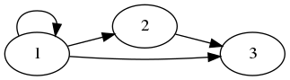
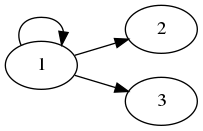

# 二元关系——运算及性质

> 前言：本篇博客主要介绍二元关系的运算及性质

## 0X00 关系的运算

关系的基本运算一共有 8 种，我们来一个一个总结

假设 $A = \{1, 2, 3\}$ R 是 A 上的关系：$R = \{<1, 2>, <1, 3>, <2, 3>\}$

### 定义域

关系的`定义域`就是 R 中所有有序对的`第一元素`构成的集合，运算定义如下：

$domR = \{x | \exists y (<x, y> \in R )\}$

所以这里的 $domR = \{1, 2\}$

### 值域

关系的`值域`就是 R 中所有有序对的`第二元素`构成的集合，运算定义如下：

$ranR = \{y | \exists x (<x, y> \in R )\}$

所以这里的 $ranR = \{2, 3\}$

### 域

关系的`域`就是 R 的`值域`与`定义域`的并集：

$fldR = domR\  \cup \ ranR$

所以这里的 $fldR = \{1, 2, 3\}$

### 逆

关系的`逆`就是 R 中将所有的有序对的`第一元素`和`第二元素`倒置：

$R^{-1} = \{<x, y>|<y,x> \in R\}$

所以这里的 $R^{-1} = \{<2,1>, <3, 1>, <3, 2>\}$

### 右复合

设 F、G 是两个二元关系。

$F = \{<1, 2>, <1, 3>\}$ 

$G = \{<2, 1>, <3, 4>, <5, 6>\}$

我们定义 $F \circ G = \{<x, y>\ |\ \exists t <x, t> \in F \wedge  <t, y> \in G\}$  

定义可能很抽象，大白话就是：`把第一个集合的第二元素和第二个集合的第一个元素相等的有序对拿出来，去掉中间相等的元素，组成一个新的有序对`

所以这里的 $F \circ G = \{<1, 1>, <1, 4>\}$

### 限制

定义：

R 在 A 上的限制 = $R \upharpoonright A = \{<x,y> \in R \wedge x \in A\}$

接着我们举一个具体例子：

假设 $A = \{1\ \}$ $R = \{<1, 3>, <2, 3>\}$

所以 $R \upharpoonright A = \{<1, 3>\}$

### 像

`像`在`限制`的基础上继续定义：

A 在 R 上的像记做 $R[A] = ran(R \upharpoonright A)$

接着我们举一个具体的例子：

假设 $A = \{1\ \}$ $R = \{<1, 3>, <2, 3>\}$

所以 $R \upharpoonright A = \{<1, 3>\}$

所以 $R[A] = \{3\}$

### 幂

这是一个复杂的运算，我们要求的就是 $R^{n}, n \in N$

首先给出最简单的运算规则：

假设 R 是 A 上的关系，$n \in N$

+ $R^{0} = I_{A} $

+ $R^{n+1} = R^{n} \circ R$

其中 $I_{A}$ 是 A 上的恒等关系

接下来给出两种运算方法：

+ 关系矩阵

假设 $A = \{1, 2\}$ $R = \{<1, 1>, <1, 2>\}$

由 R 我们可以画出 R 的关系矩阵

$$\left[\begin{matrix}1&1\\0&0\end{matrix}\right]$$

接着我们计算 $R^{2} = R × R = \left[\begin{matrix}1&1\\0&0\end{matrix}\right] × \left[\begin{matrix}1&1\\0&0\end{matrix}\right]$ 

得到$$\left[\begin{matrix}1&1\\0&0\end{matrix}\right]$$

其中的运算都是「逻辑运算」：

+ 1 + 1 = 1（或）

+ 1 + 0 = 1（或）

+ 1 * 1 = 1（与）

+ 1 * 0 = 0（与）

  

+ 关系图

假设

相比之下，`关系图`是一个更加直接的方法，

假设 $A = \{1, 2, 3\}$ $R = \{<1, 1>, <1, 2>, <1, 3>, <2, 3>\}$

有 R 我们画出关系图：

在关系图里面，$R^{2}$ 中的 2 是`距离`的意思：

比如在 R 的关系图中 1 和 2 的距离是 1,1 和 1 的距离是 0, 1, 2, 3...，1 和 3 的距离是  1 也可是 2。

所以 $R^2$ 的`关系图`就是`画出所有元素距离为 2 的边`，比如

+ 对于 1 来说，距离为 2 的边有 1 -> 1，1->3

+ 对于 2，3 来说，没有距离为 2 的边

所以 $R^2$ 的`关系图`就是：

`而且需要注意的是！画`$R^{3}$ `的时候是从 R 开始画，而不是从` $R^2$ `开始画`。

## 0X01 关系的性质

关系的性质主要有 5 种，我们来一一总结，下面的定义很抽象，要结合「关系图」，我们才能更好的理解。

### 自反与反自反

这算是比较简单的两个性质了，定义如下：

设 R 为 A 上的关系

+ **自反**

若 $\forall x(x \in A \rightarrow <x, x> \in R)$，则称 R 在 A 上是`自反`的

+ **反自反**

若 $\forall x(x \in A \rightarrow <x, x> \not\in R)$，则称 R 在 A 上是`反自反`的

### 对称与反对称

+ **对称**

  

若 $\forall x\forall y(x, y \in A \ \wedge <x, y> \in R \rightarrow <y,x> \in R)$，则称 R 在 A 上是`对称`的

 

+ **反对称**

若 $\forall x\forall y(x, y \in A \ \wedge <x, y> \in R \ \wedge <y,x> \in R \rightarrow x = y)$，则称 R 在 A 上是`反对称`的

### 传递

若 $\forall x\forall y\forall z(x, y, z \in A \ \wedge <x, y> \in R \ \wedge <y,z> \in R \rightarrow <x, z> \in R)$，则称 R 在 A 上为`传递的关系`

### 判断「关系性质」的通法

接下来我们要介绍判断这些性质的通法：

要熟记下面的内容

+ R 在 A 上`自反`，当且仅当，$I^{A} \subseteq R$

+ R 在 A 上`反自反`，当前仅当，$R\ \cap I_{A} = \emptyset$

+ R 在 A 上`对称`，当且仅当，$R = R^{-1}$

+ R 在 A 上`反对称`，当且仅当，$R\  \cap R^{-1} \subseteq I^{A}$

+ R 在 A 上`传递`，当且仅当，$R \circ R \subseteq R$

### 用「关系图」和「关系矩阵」判断关系性质

对于`关系矩阵`来说：

+ `自反`：主对角线上全是 1
+ `反自反`：主对角线全是 0
+ `对称`：矩阵是对称矩阵
+ `反对称`：若 $r_{ij} = 1 且 i \neq j，则 r_{ji} = 0$
+ `传递性`：$M^{2}$ 中 1 所在的位置，M 中相应的位置都是 1

相比之下，`关系图`就更好理解了

- `自反`：每个顶点都有环
- `反自反`：每个顶点都无环
- `对称`：无单向边
- `反对称`：无双向变
- `传递性`：如果顶点 $x_i$ 到 $x_j$ 有边，顶点 $x_j$ 到 $x_k$ 有边，则 $x_i$ 到 $x_k$ 也一定有边

## 0X02 关系的闭包

### 基本概念

设 R 是 A 上的关系，我们希望 R 具有某些有用的性质，比如`自反性`。如果 R 没有自反性，则可以通过向 R 中添加一些有序对，得到 $R^{'}$ 使得 $R^{'}$  具有自反性。而且我们希望 $R^{'}$ 与 R 相差的不是很多，这个 $R^{'}$ 就叫做 R 的`自反闭包`

同理，我们还有`对称闭包`和`传递闭包`

### 三种闭包的基本求法

+ `自反闭包`

$r(R) = R\ \cup R^{0}$

+ `对称闭包`

$s(R) = R\ \cup R^{-1}$

+ `传递闭包`

$t(R) = R\ \cup R^{2} \cup R^{3}\cup ...$

如有错误，帮忙指出！

