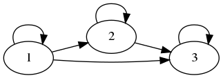
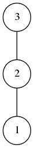
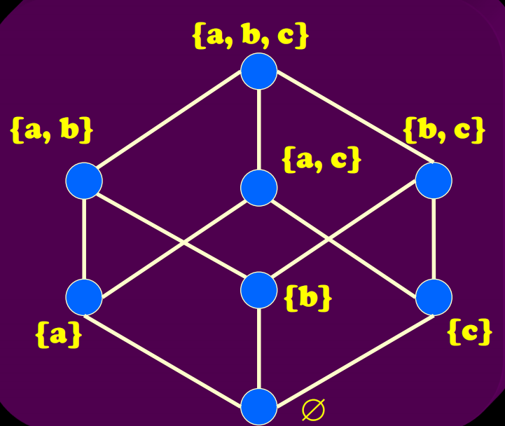
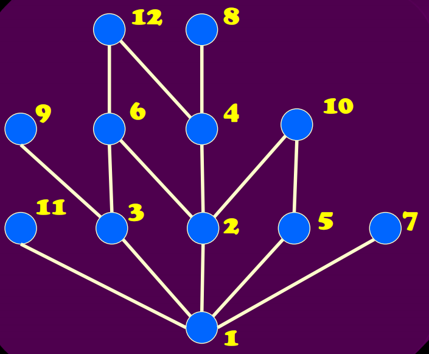
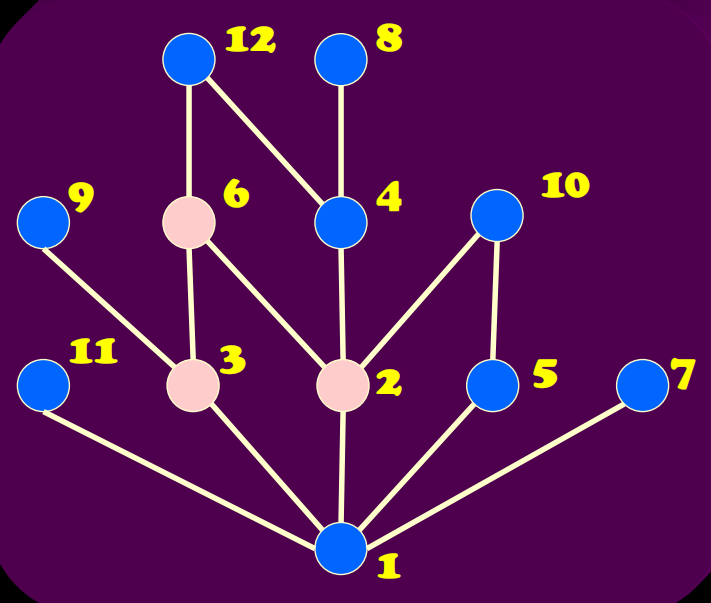
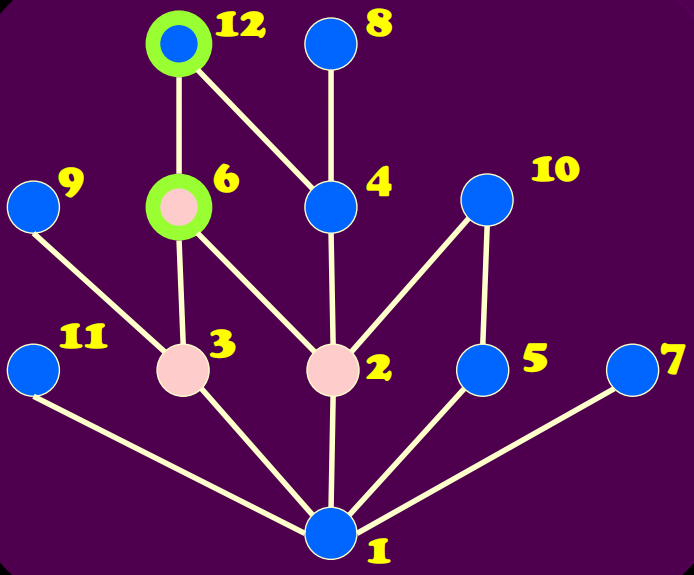

# 偏序关系

> 前言：到了二元关系中最后一部分，非常非常抽象，但是理解了就还好，我们一步一步来

## 0X00 「偏序关系」的基本定义

我们先回到最初的定义：

`假设 R 是集合 A 上的关系，如果R是自反的、反对称的和传递的，则称 R 是 A 上的一个偏序，记做` $\leqslant $ 。设 $\leqslant $ 为偏序关系，如果 $<x, y> \in \leqslant$，则记做 $ x \leqslant y$，读作 x 小于等于 y。

这个非常抽象，我们举个例子：

假设我们有这样的集合 $A = \{1, 2, 3\}$ R 是 A 上的`小于等于关系`也就是 $R = \{<x, y>| x ,y \in A \wedge x \leq y\}$

所以 $R = \{<1, 2>, <2, 3>, <1, 3>, <1, 1>, <2, 2>, <3, 3>\}$

我们画出他的`关系图`：

显然他是`自反的`（环）、`反对称的`（无双向边）、`传递的`

不知道大家看到这里的大家有没有理解到`偏序关系`的本质：

`偏序关系定义了一种方向，只能正着，反证就不行！`  （只定义一种方向当然不行）

比如这里的`小于等于`就是只有一种方向，可以 $1 \leq 2$ 就不能 $2 \leq 1$  

至此，我们引出下一个定义`可比`：

存在这种`偏序关系`的就叫做`可比`

由于这种顺序结构，我们可以用`哈斯图`来表示`偏序关系`

假设 $A = \{1, 2, 3\}, \leqslant 是 A 上的整除关系，则有$

$$\leqslant \ = \{<1, 2>, <1, 3>, <1, 1>, <2, 2>, <3, 3>\}$$

画出`哈斯图`：

这种`自底向上`的画法就是哈斯图

## 0X01 「偏序集」的基本定义

理解了`偏序关系`的基本定义以后，我们就很容易理解`偏序集`

我们把集合 A 和 A 上的偏序关系 $ \leqslant$ 一起称作`偏序集`，记做$<A,  \leqslant>$

## 0X02 「偏序集」中的特殊元素

### 最小元和最大元

我们看到这张图片，最大元就是 $a, b, c$ 最小元就是 $\emptyset$

 

所以直观来说`最大元` 就是“最大”的那个，在`哈斯图`中最上面的

相反`最小元`就是“最小”的那个，在`哈斯图`图中最小的

而在这张图中：

就不存在`最大元`只存在`最小元`因为 11 9 12 8 10 7 之间就不`可比`

### 极小元与极大元

搞清楚了`最大元`和`最小元`，我们继续，还是回到这张图上：

里面的`极大元`是 11 9 12 8 10 7，`极小元`只有 1。

`极大元`的意思就是在`可比`的那一条链中`最大的`，`极小元`的意思就是在`可比`的那一条链中`最小的`

### 上界与下界

之前的概念只在一个集合中，而谈到上下界就必须涉及到两个集合了，现在我们给出定义：

设 $<A, \leqslant> 为偏序集，B \subseteq  A, y \in A$

+ 若 $\forall x (x \in B \rightarrow x \leqslant  y)$ 则 y 是 B 的上界
+ 若 $\forall x(x \in B \rightarrow y \leqslant  x)$ 则 y 是 B 的下界

假设 $A = \{1, 2, 3, 4, 5, 6, 7, 8, 9, 10, 11, 12\}\ B = \{2, 3, 6\}$ ，定义了一个`偏序关系`并有以下哈斯图：

则 `B`  的上界就是 $6, 12$

由于 2, 3 之间不可比，所以`B` 的下界只有 $1$

### 上确界与下确界

如果能够理解`上界`和`下界`的话，`上确界`与`下确界`就更好理解了，简单来说

+ `上确界`就是`上界`中“最小”的那个
+ `下确界`就是`下界`中“最大”的那个

还是上面那个例子，B 的上界是 $6, 12$, 其中“最小”的就是 6。所以 B 的上确界就是 6。

反之 B 的下确界就是 1。

「二元关系」就结束了。。。

