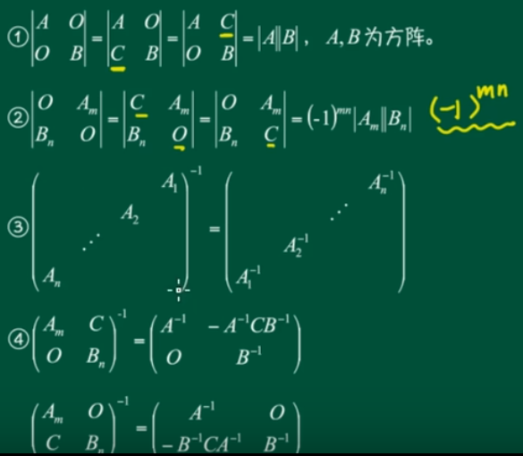
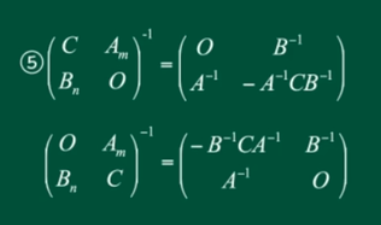

# 分块矩阵的总结

> 前言：总结一下分块矩阵

我们可以对矩阵进行任意划分，叫做`分块`。

$C=
\left[
\begin{array}{c|c}
A& B \\ \hline 
C& D
\end{array}
\right]$

每个块的大小是任意的没有必要都是方阵

### 加法

如果是两个分块矩阵相加，只有相同划分的矩阵才能相加

### 数乘

$\lambda C=
\left[
\begin{array}{c|c}
\lambda A& \lambda B \\ \hline 
\lambda C& \lambda D
\end{array}
\right]$

与矩阵的数乘一模一样

### 乘法

如果是两个分块矩阵相加，只有相同划分的矩阵才能相乘

### 转置

假设我们有矩阵：

$A = \left\{\begin{matrix}A_1&A_2\\A_3&A_4\end{matrix}\right\}$

可得：

$A^T = \left\{\begin{matrix}A_1^T&A_3^T\\A_2^T&A_4^T\end{matrix}\right\}$

### 分块对角阵（重点）

$A = \left\{\begin{matrix}A_{1}&&&\\&A_{2}&&\\&&\ddots&\\&&&A_{n}\end{matrix}\right\}$

其中 $A_i$ 都是方阵其余位置为 0，称 A 为`分块对角矩阵`。

现在我们来说它的性质：

+ $|A| = |A_1||A_2|\cdots|A_n|$
+ $A^{-1} = \left\{\begin{matrix}A_{1}^{-1}&&&\\&A_{2}^{-1}&&\\&&\ddots&\\&&&A_{n}^{-1}\end{matrix}\right\}$

主对角线与副对角线上对角阵的总结：

其中第四条与第五条有一个口诀：

+ A B 分别求逆
+ C 替换为 -C
+ 与 C 同行左除（乘以逆）
+ 与 C 同列右除（乘以逆）

+ O 在主对角线不变，在副对角线对调

