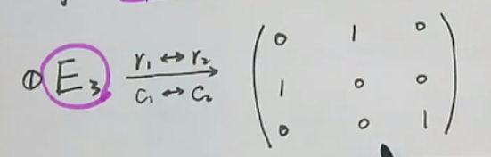
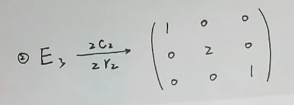
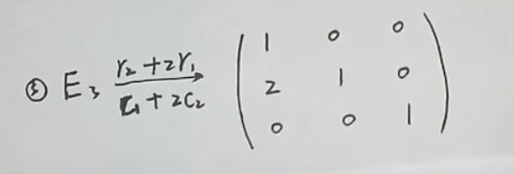

# 矩阵的初等变换

> 前言：矩阵的初等变换是重点，要好好学！

## 0X00 初等变换与矩阵等价

### 「初等行」变换以及「初等列」变换

假设我们有矩阵 A，$r_i$ 表示第 i 行，$c_j$ 表示第 j 列 

`初等行`变换有三种情况：

+ $r_i \leftrightarrow r_j$
+ $r_i \times k$
+ $r_i + k \times r_k$

`初等列`变换有三种情况：

+ $c_i \leftrightarrow c_j$
+ $c_i \times k$
+ $c_i + k \times c_k$

### 矩阵等价

矩阵等价也有三种情况：

+ 如果矩阵 A 经过一系列初等`行变换`得到矩阵 B，则 A B 等价，记做 $A \overset{r}{\Leftrightarrow} B$
+ 如果矩阵 A 经过一系列初等`列变换`得到矩阵 B，则 A B 等价，记做 $A \overset{c}{\Leftrightarrow} B$
+ 如果矩阵 A 经过一系列初等`列变换`以及一系列`行变换`得到矩阵 A，则 A B 等价，记做 $A \overset{c, r}{\Leftrightarrow} B$

## 0X01 初等矩阵

### 基本定义

`单位矩阵`经过`一次`初等变换得到的`矩阵`

同样也有三种情况：

- **两行（列）互换**：

此种`初等矩阵` $E_1$ 的逆：$E_1^{-1} = E_1$

+ **把某行（列）乘以一非零常数** $k$

此种`初等矩阵` $E_2$ 的逆：$E_2^{-1} = \frac{1}{k}E_2$

+ **把第 i 行（列）加上第 j 行（列）的 k 倍**

此种`初等矩阵` $E_3$ 的逆等于系数相反的变换

也就是 $E_3 \overset{r_i - kr_j}{\rightarrow} E_3^{-1}$

## 0X02 矩阵初等变化与矩阵乘法

现有以下两条定律：

对于矩阵：$A_{m \times n} $

+ 对 A 施行一次`初等行变换`等价于：左乘 m 阶`进行同样初等行变换`的`初等行列式`
+ 对 A 施行一次`初等列变换`等价于：右乘 n 阶`进行同样初等列变换`的`初等行列式`

总结来说就是：`左行右列`

