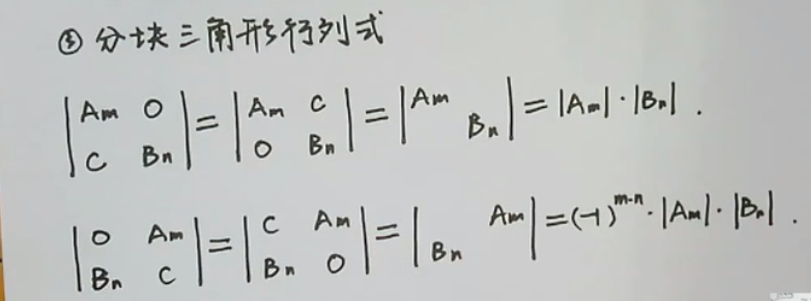

# 行列式——特殊行列式的总结

> 前言：特殊行列式的总结

## 0X00 对角行列式

可用`行列式`的基本定义去证明

## 0X01 上（下）三角形行列式

可用`行列式`的基本定义去证明

例题：

求解 $D_n = \left|\begin{matrix}a&b&b&\cdots&b\\b&a&b&\cdots&b\\\vdots&\vdots&\vdots&\ddots&\vdots\\b&b&b&\cdots&a\\\end{matrix}\right| D_n$ 的值

可得：$D_n = (a+(n-1)b)\cdot (a-b)^{n-1}$ 

## 0X02 分块三角形行列式

## 0X03 范德蒙行列式

其中 $a \neq b \neq c$，这仅仅是三阶的例子

其实`范德蒙行列式`公式最后的值只跟第二行有关：`第二行所有的数两两相减并相乘`

## 0X04 箭头形行列式

$D_n = \left|\begin{matrix}x_1&1&1&\cdots&1\\1&x_2&&&\\1&&x_3&&\\\vdots&&&\ddots&\\1&&&&x_n\end{matrix}\right|$（空白处为 0）

做法就是把第一列除第一项以外全部消掉：

$$\left|\begin{matrix}x_1 - \frac{1}{x_2}-\frac{1}{x_3}-\cdots-\frac{1}{x_n}&1&1&\cdots&1\\0&x_2&&&\\0&&x_3&&\\\vdots&&&\ddots&\\0&&&&x_n\end{matrix}\right|$$

最后得到：

$$D_n = (x_1-\sum_{i=2}^{n} \frac{1}{x_i} ) \prod_{i=2}^{n}x_i$$

## 0X05 行列式重要法则与定理

### 余子式与代数余子式

首先我们定义：

+ 余子式：$M_{ij}$
+ 代数余子式：$A_{ij} = (-1)^{i+j}M_{ij}$

所以我们先来看余子式是啥：

假设我们有$\left|\begin{matrix}a_{11}&a_{12}&a_{13}\\a_{21}&a_{22}&a_{23}\\a_{31}&a_{32}&a_{33}\end{matrix}\right|$，我们要计算 $M_{11}$ 其实`相当于把第 1 行与第 1 列划掉`，得到：$\left|\begin{matrix}-&-&-\\|&a_{22}&a_{23}\\|&a_{32}&a_{33}\end{matrix}\right| = \left|\begin{matrix}a_{22}&a_{23}\\a_{32}&a_{33}\end{matrix}\right|$

从而得到 $A_{11} = (-1)^{1+1} \left|\begin{matrix}a_{22}&a_{23}\\a_{32}&a_{33}\end{matrix}\right| = (-1)^{2} \left|\begin{matrix}a_{22}&a_{23}\\a_{32}&a_{33}\end{matrix}\right|$

### 展开定理

行列式可以按某一行或者某一列展开，达到降阶的目的，假设我们有这样的行列式：

$$D= \left|\begin{matrix}a_{11}&a_{12}&\cdots&a_{1n}\\a_{21}&a_{22}&\cdots&a_{2n}\\\vdots&\vdots&\ddots&\vdots\\a_{n1}&a_{n2}&\cdots&a_{nn}\end{matrix}\right|$$

按第一列展开：

$$D = a_{11}A_{11} + a_{12}A_{12} + \cdots + a_{1n}A_{1n}$$

### 克拉默法则

其中的 $D= \left|\begin{matrix}a_{11}&a_{12}&\cdots&a_{1n}\\a_{21}&a_{22}&\cdots&a_{2n}\\\vdots&\vdots&\ddots&\vdots\\a_{n1}&a_{n2}&\cdots&a_{nn}\end{matrix}\right|$

而 $D_n$ 就是把等式右边的 $b$ 移到第 n 列上，比如 $D_1 = \left|\begin{matrix}b_{1}&a_{12}&\cdots&a_{1n}\\b_{2}&a_{22}&\cdots&a_{2n}\\\vdots&\vdots&\ddots&\vdots\\b_{n}&a_{n2}&\cdots&a_{nn}\end{matrix}\right| $

这就是`克拉默法则`

### 齐次线性方程组的解

之前我们都是这样的式子：

$Ax = b$

而对于`齐次式`来说，我们要计算的是：

$Ax = 0$

这个方程只有两种情况：

+ 只有零解

  $|A| \neq 0$

+ 有非零解

$|A| = 0$

